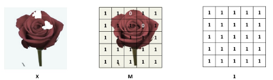

# Reconstruction of Occluded Text in Images for Optical Character Recognition

Text occlusion is among the most intractable obstacles for the task of Optical
Character Recognition (OCR) in Computer Vision. A typical example
is when some characters of a text in an image are invisible due to occlusion
them by arbitrary geometrical shapes. This causes distorting the text and
missing some characters in the word because the holes arise in the image. It
requires finding a method to reconstruct the image by filling in holes with
plausible imagery before recognizing the whole text in an image. I introduce
an approach to reconstruct an image by using Partial Convolution,
which comprises a mask and renormalized convolution operation followed
by a mask-update step to automatically generate an updated mask for the
next layer as part of the forward pass. For the recognition task, I propose
a no-recurrence sequence-to-sequence model that depends only on attention
mechanism and dispenses completely with recurrences and convolutions. The
model consists of an encoder and decoder, and uses stacked self-attention
modules. The Experiments have shown that both proposed models can produce
reconstructed images and improve the effectiveness of text recognition
in these images.

# Dependencies
  - Python 3.6
  - Keras 2.2.4
  - Tensorflow 1.12
  - OpenCV and NumPy
  - Matplotlib
  - Pandas
  
# The Proposed Model
The structure of the proposed model is based on [U-Net network](https://arxiv.org/abs/1505.04597), which
is based on encoder-decoder architecture. However, instead of using normal
convolutional operation, the network uses stacked partial convolution
operation and mask updating steps, which together form a Partial Convolutional
Layer to perform image reconstruction.

### Network Architecture
The network architecture is illustrated in figure below The network is similar to U-Net architecture 
but with some modifications to fit our task. 
It consists of an encoder and decoder with replacing all convolutional layers with Partial Convolutional 
Layers that take into account also masks and using nearest neighbor up-sampling in the decoding stage. 
The straightforward implementation is to define binary masks of size C x H x W, and the same size with 
their associated images. Mask updating is implemented using a fixed convolution layer with the same 
kernel size (filter size) as the partial convolution operation, but with weights identically set 
to 1 and bias set to 0.

### Partial Convolutional Layer
Partial Convolutional Layer comprises a masked and renormalized Convolution
Operation followed by a mask-update step. Our partial convolutional
layer is a simple convolution but before
doing the convolution we are multiplying the input patch of image with a
binary mask. So, everywhere where the mask is, we are setting the pixels to
zeros (Figure below) and then we are doing the convolution.

We refer to partial convolution operation and mask update function
jointly as the [Partial Convolutional Layer](https://arxiv.org/abs/1804.07723).
Let X be the feature values of
input image (pixel values) for the current convolution (sliding) window at
the position (i,j) and M(i,j) be the corresponding binary mask, with the
hole region being 0 and non-hole region being 1. The partial convolution
(ignoring bias) at every location is similarly defined as:
